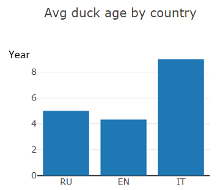
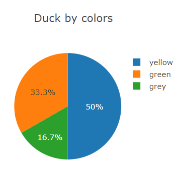
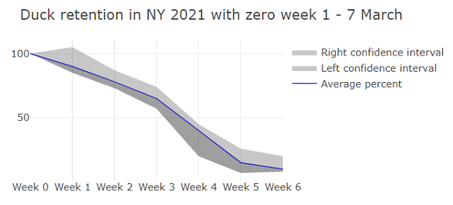
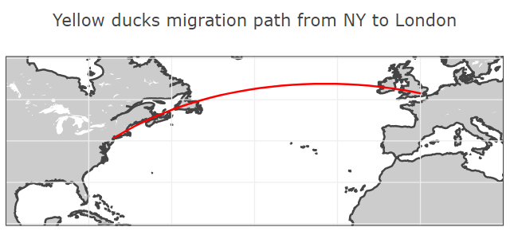
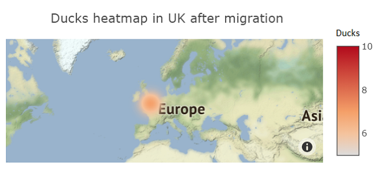

# Duck Dashboard User Guide

## Contents

- [Overview](#overview)
- [Average duck age by country](#average-duck-age-by-country)
- [Ducks by color](#ducks-by-color)
- [Duck retention](#duck-retention)
- [Migration path](#migration-path)
- [Duck heatmap after migration](#duck-heatmap-after-migration)

## Overview

With Duck Dashboard, you can track duck migration and analyze the duck population parameters, such as color and age.

The dashboard represents data in numerous formats: bar and pie charts, maps, and plots. Each dashboard element has controls that allow you to visualize the data in the clearest way.

## Average duck age by country

This bar chart shows the average duck age in years by the selected countries. To calculate that, the dashboard adds up years of all ducks in a country population and divides the sum by the number of the ducks.

Control tips:

- Hover over a bar to view its value.
- To zoom in on a section of the chart, select it with the pointer.
- To reset the zoom, double-click anywhere on the chart.

## Ducks by color

This pie chart shows the percentage of ducks that have a specific color. The chart represents the overall duck population, where each segment is the percentage of ducks of a certain color.

Control tips:

- To exclude a value from the chart, click the value marker in the chart legend.
- To return a value to the chart, click the marker again.

## Duck retention

This line chart shows the percentage of ducks that stay in the specified area during a period. The zero week value is considered 100%.

The confidence interval is the range that contains the values that are true with a certain probability. The default confidence interval is 95%.

Control tips:

- To see a value on a certain week, hover over an intersection of the chart line and the week gridline.
- To zoom in on a section of the chart, select it with the pointer. To reset the zoom, double-click anywhere on the chart.
- To exclude a line from the chart, click the line marker in the chart legend.
- To return a line to the chart, click the marker again.

## Migration path

This map shows the itinerary of the ducks between the specified cities.

Control tips:

- To move the map, click and hold the left mouse button and drag the map to a new place.
- To zoom in, place the pointer to a place and scroll down.
- To reset the map zoom and location, double-click anywhere on the map.
- To see itinerary point coordinates, hover over the point.

## Duck heatmap after migration

The heatmap shows the duck density after migration to the specified area. The more intensive the color, the more ducks in the area.

Control tips:

- To move the map, click and hold the left mouse button and drag the map to a new place.
- To zoom in, place the pointer to a place and scroll down.
- To reset the map zoom and location, double-click anywhere on the map.
